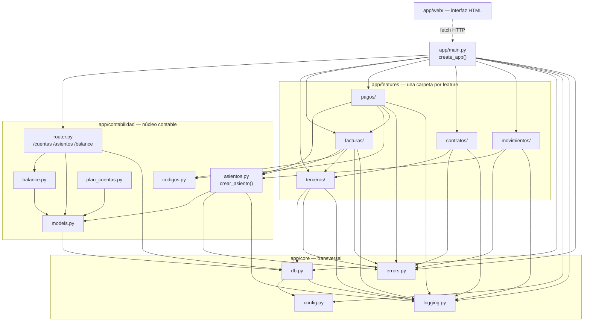

# Mapa del código — navegación para mantenimiento

Objetivo: llegar al archivo y al símbolo exacto de un cambio **sin abrir medio repo**.

## Cómo usar este mapa (leer primero)

1. **Este archivo no tiene números de línea** — se desincronizan en la primera edición.
   Da **archivo + nombre de símbolo**. Para la línea exacta:
   ```
   grep -n "def <nombre>"  backend/app/.../<archivo>.py
   ```
   (barato y siempre correcto).
2. **Índice de símbolos de todo el código**, en un solo archivo para leer de una:
   [`_generado/indice-codigo.md`](_generado/indice-codigo.md) — módulo, propósito,
   símbolos públicos con su descripción, y de qué otros módulos depende cada uno.
   Si parece viejo, regeneralo: `python scripts/generar_mapa.py`.
3. **Antes de tocar una feature**, leé su spec: `docs/features/<feature>/spec.md` (reglas de
   negocio numeradas, casos de prueba). El índice de features y su estado:
   [`features/README.md`](features/README.md).
4. **Después de cambiar código**, corré los tests de esa feature (comando en
   `features/README.md`) y actualizá el `spec.md` y `features/pruebas.md` si cambió el
   comportamiento o las pruebas.

## Reglas de arquitectura (no romperlas)

| Regla | Dónde se ve |
|---|---|
| La lógica de negocio vive **solo** en los `service.py`. Los `router.py` solo traducen HTTP y no deciden nada. | cualquier `app/features/*/router.py` |
| **Nadie** escribe en las tablas contables sin pasar por `crear_asiento`. | `app/contabilidad/asientos.py` |
| La regla de partida doble (débito = crédito) se valida **antes** de guardar. | `crear_asiento` + `Asiento.cuadra()` |
| Los servicios lanzan errores de dominio (`NoEncontrado`, `Conflicto`, `DatosInvalidos`), **nunca `HTTPException`**. `main.py` los traduce a HTTP. | `app/core/errors.py`, `app/main.py` |
| Todo async. Las relaciones del ORM se cargan explícitas (`lazy="selectin"` o `selectinload`), nunca perezosas. | `app/contabilidad/models.py` |
| El balance se calcula con **una** consulta SQL, no iterando objetos. | `app/contabilidad/balance.py` |
| Toda la config viene de `app/core/config.py` (que lee `.env`). Nadie lee `os.environ` por su cuenta. | `app/core/config.py` |
| El chatbot de WhatsApp (Módulo 2, aún no construido) será **100 % determinístico**. | `docs/aprendizaje/deterministico-vs-ia.md` |

## Grafo de dependencias (módulos)



## Índice por tarea — "quiero cambiar…"

| Quiero cambiar… | Archivo(s) | Símbolo | Spec |
|---|---|---|---|
| las cuentas del plan (agregar/renombrar) | `app/contabilidad/plan_cuentas.py` | `PLAN_DE_CUENTAS_INICIAL` | `features/contabilidad-nucleo/spec.md §5` |
| la regla de asiento de una **factura** (recibida/emitida) | `app/features/facturas/service.py` | `registrar_factura` | `features/facturas/spec.md §3` |
| cómo se separa/netea el **IVA** | `app/features/facturas/service.py` + `app/contabilidad/codigos.py` | `registrar_factura`, `IVA` | `features/facturas/spec.md §8`, `features/contabilidad-nucleo/spec.md §8` |
| la regla de asiento de un **pago/cobro** | `app/features/pagos/service.py` | `pagar_factura` | `features/pagos/spec.md §3` |
| los **medios de pago** válidos (hoy caja/bancos) | `app/contabilidad/codigos.py` | `MEDIOS_PAGO` | `features/pagos/spec.md §3` |
| las validaciones de un **movimiento manual** | `app/features/movimientos/service.py` | `registrar_movimiento_manual` | `features/movimientos/spec.md §3` |
| el cálculo del **balance** / el signo por naturaleza / el filtro libro (oficial\|interna\|todos) y periodo | `app/contabilidad/balance.py` | `calcular_balance`, `FiltroLibro`, `condiciones_asiento` | `features/balance/spec.md §3` |
| el **extracto de una cuenta** (movimientos + saldo acumulado) | `app/contabilidad/detalle_cuenta.py` | `movimientos_de_cuenta` | `features/balance/spec.md §5` |
| el **árbol de análisis** de la interfaz (tipo→cuenta→extracto) o el selector Oficial/Interno/Total / año-mes | `app/web/app.js` | `cargarBalance`, `montarControles`, `paramsAnalisis` | `features/web-ui/spec.md §5` |
| qué campos de un formulario son **obligatorios** | `app/web/index.html` (marca `*`) + el `*Create` en `app/features/<f>/schemas.py` (Pydantic `required`) | — | `features/web-ui/spec.md §5` |
| la validación central de **partida doble** | `app/contabilidad/asientos.py` | `crear_asiento`, `Asiento.cuadra` | `features/contabilidad-nucleo/spec.md §3` |
| el **actor / tercero de un asiento** (con quién se hizo) o los tipos de tercero | `app/contabilidad/models.py` (`Asiento.tercero_id`) + `app/features/terceros/models.py` (`TipoTercero`) + cada `service.py` que lo pasa a `crear_asiento` | `Asiento.tercero`, `TipoTercero` | `features/terceros/spec.md` |
| un **campo nuevo** en una tabla | `app/features/<f>/models.py` (o `app/contabilidad/models.py`) → luego `alembic revision --autogenerate` | — | el `spec.md §4` de esa feature |
| el **enlace a un documento** (RUT, PDF de factura/contrato) o su validación | `app/documentos/enlace.py` + campos `enlace_rut` / `enlace_documento` en los modelos | `validar_enlace` | `features/documentos/spec.md` |
| pasar los documentos a **S3 / almacenamiento real** | `app/documentos/` (agregar `almacenamiento.py` con adaptador) | — | `features/documentos/spec.md §8` |
| un **endpoint** (ruta, filtros, forma de la respuesta) | `app/features/<f>/router.py` + `.../schemas.py` | el handler | el `spec.md §5` de esa feature |
| el **manejo de errores** global / el shape del 500 | `app/main.py` | los `@app.exception_handler` | `arquitectura/resiliencia-y-logs.md` |
| qué se **loguea** y cómo | `app/core/logging.py` + `_log.info(...)` en cada service | `configurar_logging` | `arquitectura/resiliencia-y-logs.md` |
| la **conexión a la BD** / el pool / pasar a PostgreSQL | `app/core/db.py` + `.env` (`DATABASE_URL`) | `engine`, `_opciones_engine` | `arquitectura/base-de-datos.md` |
| una **variable de configuración** | `app/core/config.py` + `.env.example` | `Settings` | — |
| la **interfaz gráfica** (pantalla, formulario, columna) | `app/web/app.js` + `app/web/index.html` | la función `cargar<Pantalla>` | `features/web-ui/spec.md §5` |
| el **Dockerfile** / arranque del contenedor | `backend/Dockerfile`, `backend/docker-entrypoint.sh`, `docker-compose.yml` | — | `arquitectura/despliegue.md` |
| una **migración** de esquema | `backend/alembic/versions/` (generar con `alembic revision --autogenerate -m "..."`) | — | `arquitectura/base-de-datos.md` |

## Dónde está cada cosa transversal

| Cosa | Archivo |
|---|---|
| Configuración / `.env` | `backend/app/core/config.py` |
| Motor y sesión de BD, `get_db`, chequeo de conexión | `backend/app/core/db.py` |
| Errores de dominio (`NoEncontrado`, `Conflicto`, `DatosInvalidos`) | `backend/app/core/errors.py` |
| Enlaces a documentos (validación, futuro S3) | `backend/app/documentos/enlace.py` |
| Logging (formato, niveles, `log("area")`) | `backend/app/core/logging.py` |
| Ensamblado de la app, middleware, manejadores de error, `/salud` | `backend/app/main.py` |
| Agregador de modelos (para Alembic y tests) | `backend/app/models.py` |
| Fixtures de test | `backend/tests/conftest.py` |
| Semilla del plan de cuentas | `backend/app/seed.py` + `app/contabilidad/plan_cuentas.py` |

## Flujo de una petición (para ubicar dónde intervenir)

```
HTTP  →  app/features/<f>/router.py   (valida formato con el schema, llama al service)
      →  app/features/<f>/service.py  (TODA la regla de negocio; lanza errores de dominio)
      →  app/contabilidad/asientos.py (si genera asiento: valida cuadre, escribe)
      →  app/**/models.py             (tablas)
error →  app/main.py                  (traduce el error de dominio / inesperado a HTTP + log)
```
